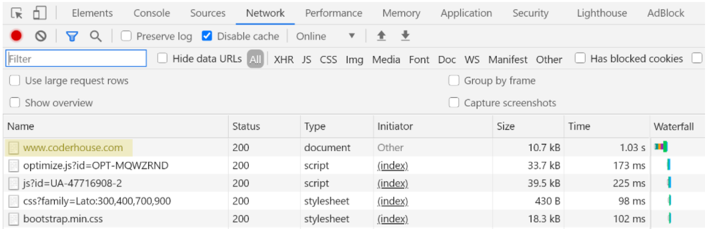
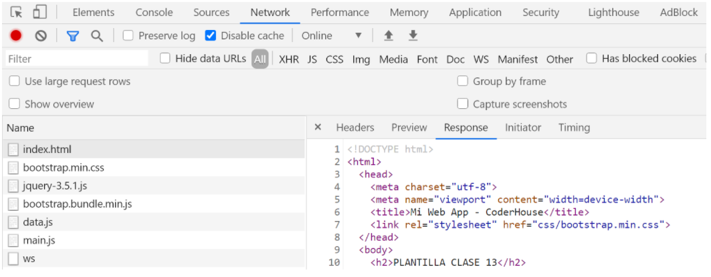
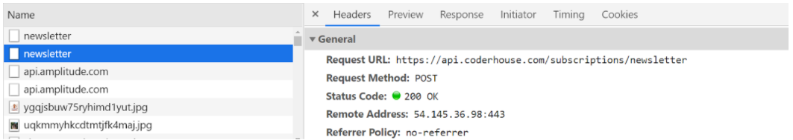
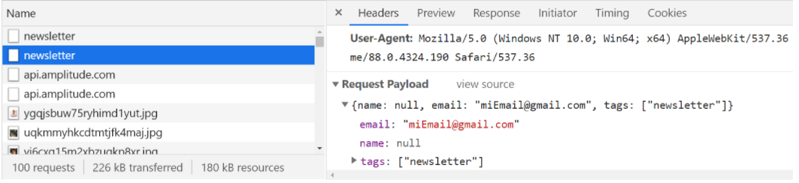
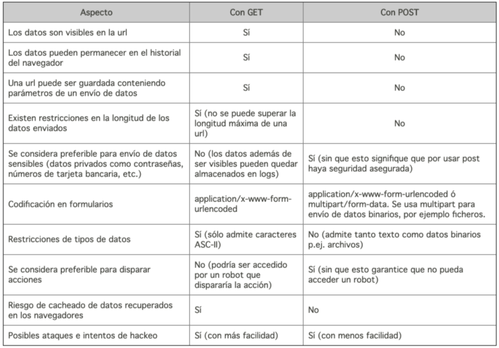
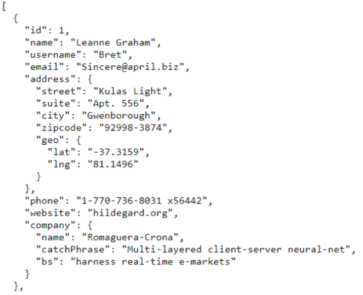
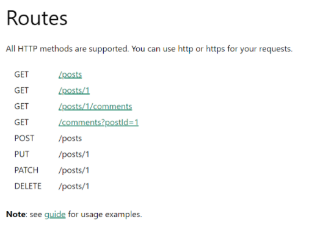

# [JavaScript Clase 13] AJAX con jQuery

AJAX significa JavaScript asincrónico y XML (Asynchronous JavaScript and XML). Es un conjunto de técnicas de desarrollo que permiten que las aplicaciones web funcionen de forma asincrónica, pudiendo procesar tareas en segundo plano. 
Un proceso asíncrono tiene la característica de no generar tiempo de espera por la respuesta. Como resultado, **cualquier app o web que use AJAX puede enviar y recibir datos del servidor sin la necesidad de volver a cargar toda la página.**

### Comunicacion con el servidor

Antes de ver cómo utilizar AJAX, debemos entender cómo se envían los datos al servidor mediante AJAX. **Se utiliza el protocolo HTTP para comunicarnos con el servidor**. Con HTTP empleamos métodos (llamados métodos de petición) para acceder o enviar recursos e información al servidor.

### Método GET

Cada vez que utilizamos el navegador para acceder a una dirección web (por ejemplo  https://www.coderhouse.com/), estamos usando el método GET: 
El mencionado método de petición sirve para solicitar un recurso específico del servidor. Las peticiones GET son utilizadas para  acceder a datos, páginas o imágenes, entre otros recursos.  Si nos dirigimos a la pestaña red (network) de nuestra consola de desarrollo, podremos observar todas las peticiones realizadas por el cliente al momento de solicitar un sitio:



Podemos observar que por cada petición, existe una descripción de estado (status): estos son códigos de respuesta otorgados por el servidor cada vez que el cliente realiza una. El código 200 significa que el recurso solicitado ha sido recuperado, y se transmite en forma de respuesta. Para el caso de una petición GET sobre un documento HTML, el servidor responde la estructura del propio documento, por ejemplo:



Como programadores/as, empleamos el código de respuesta de la petición GET para saber si el recurso se obtuvo correctamente; de ser así, podemos incluir la respuesta en nuestra aplicación, caso contrario volvemos a solicitar el elemento al servidor, informamos al usuario que el mismo no se cargó correctamente, o no existe.

### Método POST

Cada vez que enviamos datos usando un formulario, empleamos el método POST, como en el ejemplo, al suscribirse al Newsletter de CoderHouse:

El método POST nos permite enviar datos al servidor, los cuales serán procesados y posiblemente almacenados en una base. Asimismo, para la petición POST contamos con el código de respuesta, el cual será 200 si la información fue procesada correctamente:



Como programadores/as empleamos el código de respuesta de la petición POST para saber si la informaciòn enviada se procesó correctamente, y en consecuencia efectuar una salida de confirmación de registro.

También es posible visualizar la información enviada durante una petición POST, al igual que el tipo de información (Content-Type), en la parte de la petición HTTP identificada como la cabecera o header:



### Diferencias entre GET y POST

Si bien existen otros métodos HTTP, GET y POST son los más empleados porque permiten cubrir gran parte de las situaciones de comunicación cliente-servidor. Es decir, solicitar y enviar datos al back-end es una tarea recurrente en nuestra aplicación, por lo cual tenemos la necesidad de conocer cómo funcionan estos métodos, y cuáles son sus diferencias. Para compararlos, podemos tomar la siguiente tabla como referencia:



Una de las diferencias más importantes entre ambos es que GET está pensado como método de acceso, razón por la cual las URLs GET pueden ser almacenadas en el historial, o indexadas por buscadores. En cambio las direcciones que emplean POST, al ser este un método reservado al envío de datos en distintos formatos, no pueden utilizarse para navegar.

Cabe aclarar que es posible que una solicitud GET contenga parámetros, lo cual implica enviar cierta información al servidor en la propia dirección (por ejemplo: http://www.domain.com/index.html?parametro1=value1). Generalmente, la información más relevante a almacenar en el servidor se envía usando POST, ya que este método permite determinar el formato de la información a enviar, usando una ruta de acceso no disponible mediante GET.

Por último, en la actualidad existe HTTPs, el cual se encuentra basado en HTTP, siendo un protocolo de comunicación más seguro entre cliente y servidor. En el mismo se encriptan los datos para garantizar la seguridad de las peticiones. No obstante, los métodos de petición son los mismos que HTTP.

### AJAX con jQuery

Para emplear los métodos AJAX con jQuery se utiliza un conjunto de métodos que generalmente reciben dos parámetros: 

- **Una URL** (absoluta o relativa) del archivo que va a procesar la llamada. 
- **Un array** de parámetros (puede no ser necesario en caso de usar GET). 

Estos parámetros son procesados por servidor para realizar operaciones, y luego retornar cierta información al cliente en modo de respuesta.
**Todo esto puede ocurrir mientras en la App o web el usuario sigue en la misma pantalla, es decir, que no se recarga la ventana.**

### Formato de envío, datos y respuesta

¿En qué formato se recibe o envía información al servidor?
Se recibe mediante **texto plano**. Una forma de estandarizar este proceso y recibir información más compleja es utilizar **JSON**. Como ya vimos, es un formato basado en texto plano para representar datos estructurados en la sintaxis de objetos de JavaScript. De esa forma podemos recibir texto plano, texto en HTML, arrays, etc.



## Métodos AJAX con jQuery

Ahora que contamos con un reconocimiento del funcionamiento de HTTP,  es preciso recordar que el objetivo al emplear AJAX es realizar peticiones HTTP al servidor, y procesar las respuestas en segundo plano. Para esto, realizaremos las peticiones usando JavaScript o alguna librería. 
En la actualidad existen varias forma de realizar esto, entre las cuales podemos mencionar:

- Objeto XMLHttpRequest en JavaScript.
- API fetch en JavaScript Vanilla.
- Métodos AJAX en jQuery.
- Libreria Axios.

Nos centraremos inicialmente en los métodos AJAX con jQuery, ya que son un poco más fáciles de aprender, y comparten características tanto en notación como en funcionamiento con la API fetch, sirviendo también de introducción al concepto de promesas en JavaScript.

**¿Cómo usar los  métodos AJAX en jQuery?**

Los métodos AJAX más utilizados en jQuery con $.ajax(), $.get(),  $.getJSON() y $.post(). En realidad, $.get(), $.post() y $.getJSON(), son métodos abreviados de casos de uso del método $.ajax(), es decir que se emplean para simplificar peticiones HTTP asíncronas, las cuales podrían realizarse todas con el mismo método.
¿Por qué existen estos métodos? Es sencillo de entender: cuando se repite tanto una configuración, se tiende a simplificar su empleo realizando una función o método para reemplazar instrucciones repetitivas.
Los métodos abreviados de AJAX pueden recibir los siguiente parámetros:

- Una URL (absoluta o relativa) del archivo o dirección que va a procesar la llamada, 
- Una función callback para manejar la respuesta de la petición.
- Un array de parámetros (puede no ser necesario en caso de usar GET): 
 
Los datos enviados son adquiridos por el servidor para realizar operaciones, una vez procesados se responde al cliente, desencadenando la llamada a la función callback previamente definida. En el callback de la función podemos definir, por ejemplo, que se efectúe una salida, o se modifique cierta parte de la página, utilizando la información obtenida del servidor. Esto implica la capacidad de actualizar toda o parte de la aplicación, sin la necesidad de recargar esta última o interrumpir las acciones del usuario, determinando un verdadero grado de interactividad.
En cuanto al formato con el que se envían los datos, cabe aclarar que el servidor recibe información en texto plano. Por ende, una forma de estandarizar el envío de datos al backend y recibir como respuesta información detallada es emplear JSON; como ya vimos, es un formato en texto plano que permite representar datos estructurados en la sintaxis de objetos de JavaScript, pudiendo pararlos para operar sobre ellos. En los próximos párrafos presentaremos tres ejemplos de llamadas asíncronas empleando los métodos abreviados de jQuery. 


### Llamada AJAX: GET

Podemos emplear el método $.get() para solicitar un dato puntual del servidor. En el siguiente ejemplo solicitamos cierta informaciòn en formato JSON , disponible en la direccion https://jsonplaceholder.typicode.com/posts. Cuando el servidor responde la petición GET, se verifica que el estado es correcto, usando la comparación (estado ==”success” ) en un condicional. De ser así, se efectúa una salida en el DOM usando la información obtenida:

```javascript
//Declaramos la url que vamos a usar para el GET
const URLGET = "https://jsonplaceholder.typicode.com/posts"
//Agregamos un botón con jQuery
$("body").prepend('<button id="btn1">GET</button>');
//Escuchamos el evento click del botón agregado
$("#btn1").click(() => { 
    $.get(URLGET, function (respuesta, estado) {
          if(estado === "success"){
            let misDatos = respuesta;
            for (const dato of misDatos) {
              $("body").prepend(`<div>
                                   <h3>${dato.title}</h3>
                                   <p> ${dato.body}</p>
                                  </div>`);
            }  
          }
    });
});
```

### Llamada AJAX: POST

En el caso del método POST, el segundo parámetro comprende un valor o variable que podemos enviar al servidor al momento de realizar la llamada. Para verificar el funcionamiento de post, empleamos la URL https://jsonplaceholder.typicode.com/posts, dirección que nos responde con los mismos datos enviados, si bien se supone que al realizar POST existe un procesamiento y almacenamiento de la información enviada. Así, sólo podemos simular el post enviando cierta información y manejando la respuesta con la función callback, ya que no contamos con nuestro propio back-end de aplicación. En consecuencia, nuestro manejo de respuesta del POST  se limita a informar al usuario que se guardó correctamente la información enviada con una salida modificando el DOM:

```javascript
//Declaramos la url que vamos a usar para el GET
const URLGET   = "https://jsonplaceholder.typicode.com/posts"
//Declaramos la información a enviar
const infoPost =  { nombre: "Ana", profesion: "Programadora" }
//Agregamos un botón con jQuery
$("body").prepend('<button id="btn1">POST</button>');
//Escuchamos el evento click del botón agregado
$("#btn1").click(() => { 
    $.post(URLGET, infoPost ,(respuesta, estado) => {
        if(estado === "success"){
            $("body").prepend(`<div>
Guardado:${respuesta.nombre}
</div>`);
        }  
    });
});
```

### Ejemplo: Archivo JSON estático

Dado que a veces contamos con archivos .json en nuestro proyecto, estos podrían cargarse empleando el método getJSON. El método funciona de forma similar a get, pero es preferible si se opta por cargar archivos con este formato de forma local en el proyecto.
De la misma forma que en las otras peticiones, al culminar la carga del archivo local por el servidor se dispara el método callback, realizando un modificacion en el DOM si la peticion fue exitosa:


```javascript
//Declaramos la url del archivo JSON local
const URLJSON = "data/datos.json"
//Agregamos un botón con jQuery
$("body").prepend('<button id="btn1">JSON</button>');
//Escuchamos el evento click del botón agregado
$("#btn1").click(() => { 
$.getJSON(URLJSON, function (respuesta, estado) {
    if(estado === "success"){
      let misDatos = respuesta;
      for (const dato of misDatos) {
        $("body").prepend(`<div>
                                <h3>${dato.name}</h3>
                                <p> ${dato.email}</p>
                            </div>`)
      }  
    }
    });
});
```

### Algunos usos de AJAX con jQuery

- Agregar o modificar productos a un carrito de compras.
- Enviar un formulario sin refrescar la página.
- Agregar o quitar productos de una wishlist.
- Enviar un comentario en un blog.
- Notificaciones en Facebook, Twitter.
- Ventanas de chats.

## API

API o **Application Programming Interfaces**, es un conjunto de reglas y especificaciones que las aplicaciones pueden seguir para comunicarse entre ellas. El uso de una API es el **mecanismo más útil para conectar dos softwares entre sí**. De esta manera, podemos garantizar el intercambio de mensajes o datos en **formato estándar**.
Nos conectamos al API para obtener o enviar información.

Por ejemplo: una web de e-commerce que permite pagar con MercadoPago, está integrando la API de MP, mediante la cual una web X puede cobrar una compra. Esa web usará las funciones y reglas de la API de MP para integrarla a sus necesidades del e-commerce.

### API + jQuery + AJAX

**Una de las formas** de comunicarse con una API (siempre y cuando esta lo contemple) es utilizar **AJAX en jQuery**. 
En la práctica sería muy similar a realizar una llamada AJAX común, solo que tendremos que cumplir los requisitos que la API defina para cada llamada. 
Por ejemplo: si fuera una API de una plataforma de pagos, podremos usar llamadas para enviar pagos, para consultar cuotas, etc.

### Ejemplo aplicado: POST al API:

```javascript

$( document ).ready(function() {
    //Declaramos la url del API
    const APIURL = 'https://jsonplaceholder.typicode.com/posts' ; 
    //Declaramos la información a enviar
    const infoPost =  { nombre: "Ana", profesion: "Programadora" }
    //Agregamos un botón con jQuery
    $("body").prepend('<button id="btn1">ENVIAR API</button>');
    //Escuchamos el evento click del botón agregado
    $("#btn1").click(() => { 
        $.ajax({
            method: "POST",
            url:  APIURL,
            data: infoPost,
            success: function(respuesta){
                $("body").prepend(`<div>${respuesta.nombre}</div>`);
            }
        });
    });
});
```

- Tanto para el uso de jQuery y APIs siempre vas a necesitar el frontend (en este caso JS), y un backend, ya que estas interactuando entre un cliente y un servidor.
- Una API no es un lenguaje, es una metodología de trabajo para programar un conjunto de reglas bajo una necesidad funcional.
- Una API puede estar programada en diferentes lenguajes: php, asp, etc; y puede llamarse mediante otros: JS, HTTP Request, PHP, etc.

### Ejemplo con API de JSONPlaceholder:

Si tomamos por ejemplo la API de JSONPlaceholder, podremos notar que existen distintas rutas que podemos usar:



Cada una de estas direcciones puede ser empleada teniendo en cuenta el tipo de método HTTP soportado, es decir que la llamada debe usar el método señalando: si es GET la llamada asíncrona con jQuery es $.get(); en cambio, si la ruta es POST, el método de llamada es $.post().

Pueden existir direcciones que pueden ser llamadas con màs de un método HTTP (como es el caso de /post en JSONPlaceholder) pero esta configuración depende del servidor, en específico depende de cómo el backend del api está construido y que métodos HTTP admite en cada ruta.

En una aplicación moderna, es común requerir que el frontend interactúe con una o más APIs. Ya que las APis permiten conectar sistemas o partes de sistemas web entre si. Por ejemplo: una aplicación e-commerce que permite pagar con MercadoPago, usarà el API de Mercado Pago para registrar la compra del producto. 

Hay que tener en cuenta que cada API está construida de forma distinta, teniendo distintas reglas de acceso. Si bien siguen un convención de construcción conocida como API REST, es necesario que el programador/a determine qué APIs necesita emplear en el sistema, por qué y cómo emplear las llamadas asíncronas  para enviar y obtener datos de ellas correctamente.

## Código de clase:

### HTML

```html
<!DOCTYPE html>
<html lang="en">

<head>
    <meta charset="UTF-8">
    <meta http-equiv="X-UA-Compatible" content="IE=edge">
    <meta name="viewport" content="width=device-width, initial-scale=1.0">
    <!-- CSS only -->
    <link href="https://cdn.jsdelivr.net/npm/bootstrap@5.0.2/dist/css/bootstrap.min.css" rel="stylesheet" integrity="sha384-EVSTQN3/azprG1Anm3QDgpJLIm9Nao0Yz1ztcQTwFspd3yD65VohhpuuCOmLASjC" crossorigin="anonymous">
    <title>Clase 14</title>
</head>

<body>
    <h2>Llamadas Ajax<small class="text-muted"> con JQuery</small></h2>
    <section>
        <table class="table table-dark">
            <thead>
                <tr>
                    <th>ID</th>
                    <th>Nombre</th>
                </tr>
                <tbody id="libros">
                    <!-- aca ingresan los datos del json libros tolkien -->
                </tbody>
            </thead>
        </table>
    </section>
    <section id="empleados">
        <!-- Empleados aqui -->
    </section>
    <section id="llamada">
        <!-- Aqui la diapo 29 -->
    </section>
    <!-- JavaScript Bundle with Popper -->
    <script src="https://cdn.jsdelivr.net/npm/bootstrap@5.0.2/dist/js/bootstrap.bundle.min.js" integrity="sha384-MrcW6ZMFYlzcLA8Nl+NtUVF0sA7MsXsP1UyJoMp4YLEuNSfAP+JcXn/tWtIaxVXM" crossorigin="anonymous"></script>
    <script src="https://code.jquery.com/jquery-3.5.0.js"></script>
    <script src="script.js"></script>
</body>

</html>
```

### JavaScript

```javascript
//JQuery AJAX

$(document).ready(function() {
    obtenerDatos();
    agregarDatos();
});

function obtenerDatos() {
    $.get("https://the-one-api.dev/v2/book").done(function(resultado, estado) {
        console.log("Estado que retorna el metodo get: " + estado);
        if (estado == "success") {
            let datosRecibidos = resultado.docs;
            datosRecibidos.forEach(libro => {
                $("#libros").append("<tr><td>" + libro._id + "</td><td>" + libro.name + "</td></tr>");
            });
        }
    });
}
//POST
function agregarDatos() {
    let objetoJson = {
        "userId": 1,
        "id": 617,
        "title": "Prueba",
        "body": "bla bla"
    }
    $.post("https://jsonplaceholder.typicode.com/posts", objetoJson).done(function(data, estado) {
        //lo que retorna
        console.log("Estado jsonPlaceholder: " + estado);
        console.log("Data de retorno: " + JSON.stringify(data));
    });
}

//GETJSON
const URLJSON = "users.json";
//Agregamos un botón con jQuery
$("#empleados").prepend('<button id="btn">JSON local (EMPLEADOS)</button>');
//Escuchamos el evento click del botón agregado
$("#btn").click(() => {
    $.getJSON(URLJSON, function(respuesta, estado) {
        if (estado === "success") {
            let misDatos = respuesta.usuarios;
            for (const dato of misDatos) {
                $("#empleados").prepend(`<div>
                                <h3>${dato.nombre}</h3>
                                <p> ${dato.puesto}</p>
                            </div>`)
            }
        }
    });
});

//DIAPO 29
$(document).ready(function() {
    //Declaramos la url del API
    const APIURL = 'https://jsonplaceholder.typicode.com/posts';
    //Declaramos la información a enviar
    const infoPost = { nombre: "Ana", profesion: "Programadora" }
        //Agregamos un botón con jQuery
    $("#llamada").prepend('<button id="btn1">ENVIAR API</button>');
    //Escuchamos el evento click del botón agregado
    $("#btn1").click(() => {
        $.ajax({
            method: "POST",
            url: APIURL,
            data: infoPost,
            success: function(respuesta) {
                console.log(respuesta);
                $("#llamada").prepend(`<div>${respuesta.nombre}</div>`);
            }
        });
    });
});
```

### JSON

```json
{
    "usuarios": [{
            "nombre": "Juan Pablo Gomez",
            "edad": 45,
            "puesto": "Supervisor",
            "antiguedad": 3,
            "premios": null,
            "vacaciones": "2 semanas"
        },
        {
            "nombre": "Veronica Alberi",
            "edad": 35,
            "puesto": "Analista",
            "antiguedad": 5,
            "premios": 2,
            "vacaciones": "3 semanas"
        }
    ]
}
```

